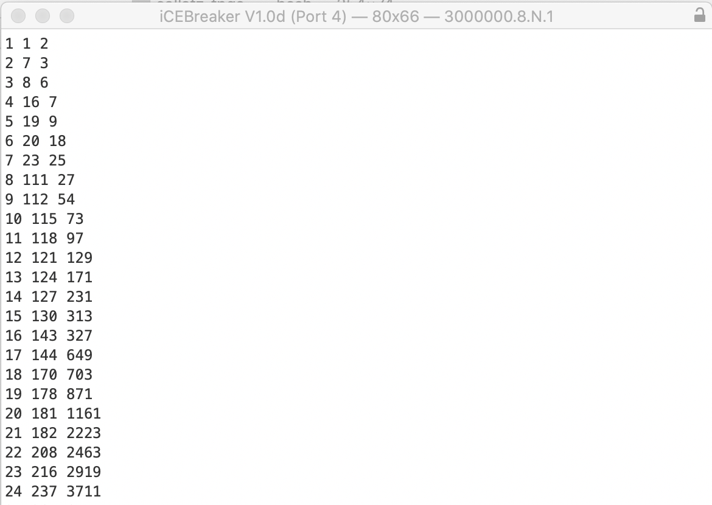

## Collatz

A simple [ICEBreaker FPGA board](https://1bitsquared.com/products/icebreaker) example to calculate and print the length and starting number of increasingly long [Collatz](https://en.wikipedia.org/wiki/Collatz_conjecture) sequences on a terminal.

The first column numbers each newly found longest sequence (1,2,3,...). The 2nd number is the length of the sequence, and the 3rd number is the starting number of the Collatz sequence.



### Programming the Board

The Python code uses [nMigen](https://github.com/m-labs/nmigen) to generate the hardware description. nMigen invokes the [YosysHQ](https://github.com/YosysHQ) synthesis tools and [IceStorm](http://www.clifford.at/icestorm/) to load the bitfile onto the board. Install these tools, following their respective instructions.

To program the ICEBreaker board, connect it and run:

```shell
$ python3 collatz_driver.py program
```

Synthesis takes a while because the `bcd.py` conversion generates a lot of arithmatic hardware. The [ususal BCD approach](https://my.eng.utah.edu/~nmcdonal/Tutorials/BCDTutorial/BCDConversion.html) would obviously be better here, but I was interested in the arithmatic for other reasons.

### Getting the Results

Open a serial terminal (e.g. [miniterm.py](https://github.com/pyserial/pyserial/blob/master/serial/tools/miniterm.py)) and configure it for 3000000 baud, `8,N,1`. To use a lower baud rate, see the comments in `uart_wrapper_nmigen.py`.

Press the capital `A` letter on the keyboard to start the computation and the printing. The terminal will beep after each new record line is printed (`miniterm.py` may or may not; on OSX `Serial.app` does).

#
